# Book Manager application

This application is an example to show hot to create a full stack CAP application to manage books
In order to execute this application you need to meet the following prerequisites:

## Prerequisites
1. Configure SAP HANA Cloud
2. Configure SAP Cloud Identity Service
3. Configure SAP Build Workzone standard edition

## Configure SAP HANA Cloud
1. To configure SAP HANA Cloud in the trial landscape you need to subscribe first to SAP HANA Cloud tools
    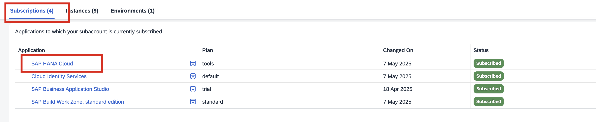

1. Configure a HANA instance like this:
    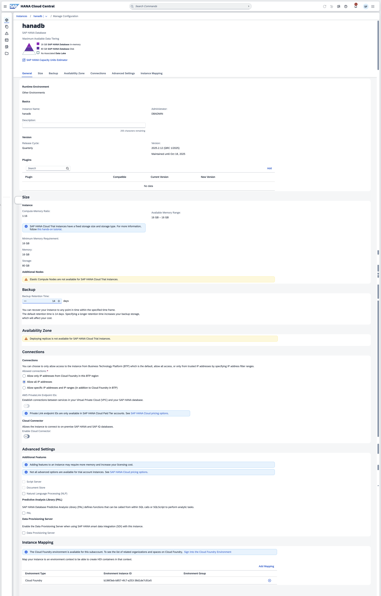

1. Remember that to execute the application this instance must be in status of **Running**
    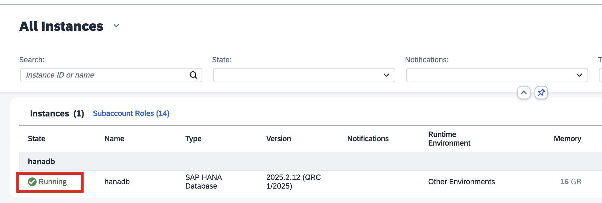

## Configure SAP Cloud Identity Service.
1. Subscribe to the SAP Cloud Identity Service
    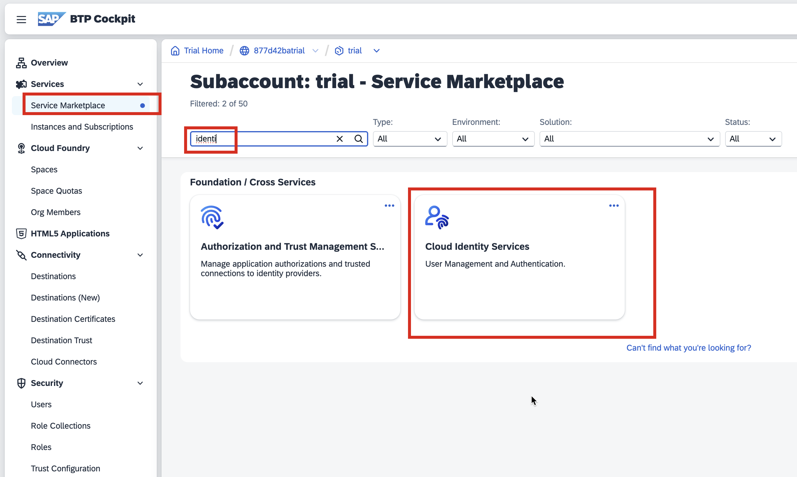

1. You will receive an email to activate your user: click on the link received and set your password

1. Then go to Trust Configuration, click on **Establish Trust** and follow the steps on the screen by confirming all the options
    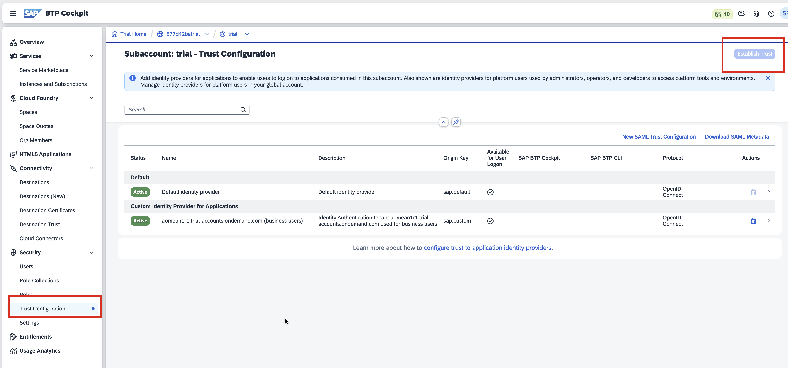

1. At the end your should see a new Identity Provider Configured. This will be required to access the workzone
    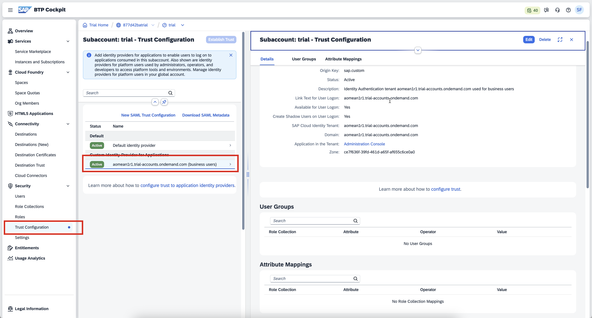

## Configure SAP Build Workzone standard edition
1. Subscribe to SAP Build Workzone
    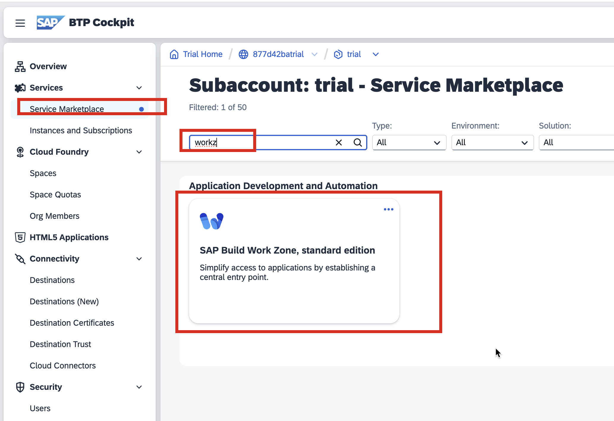

1. Try to access Workzone using the **Go to Application** button. You will receive an error, but a new shadow user is created in the BTP cockpit
    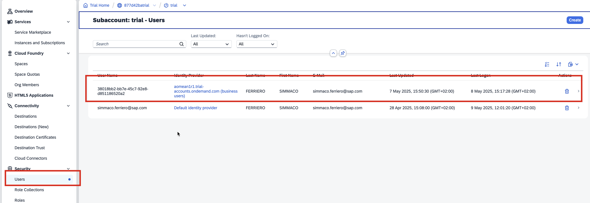

1. Click on this user and assign to it these Role Collections
    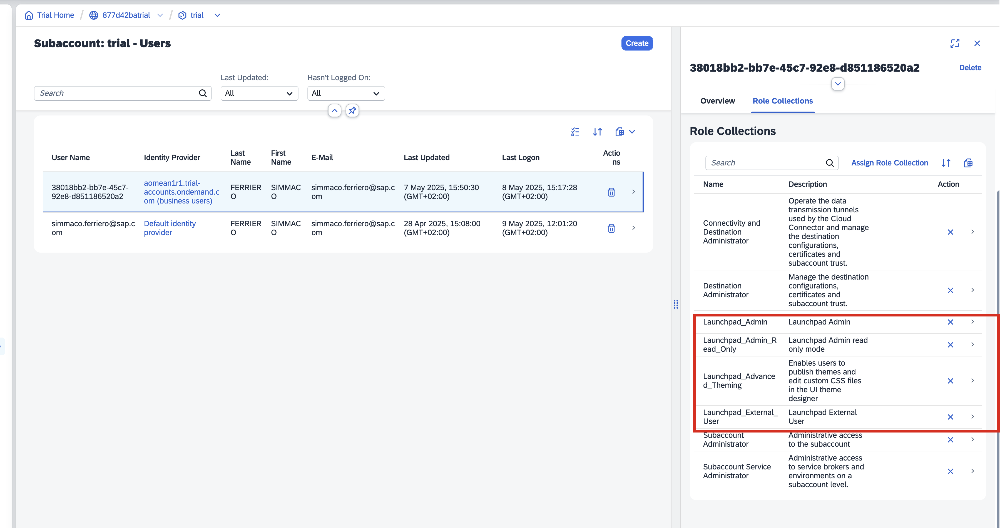

1. Logout and login and you should be able to access the SAP Workzone
    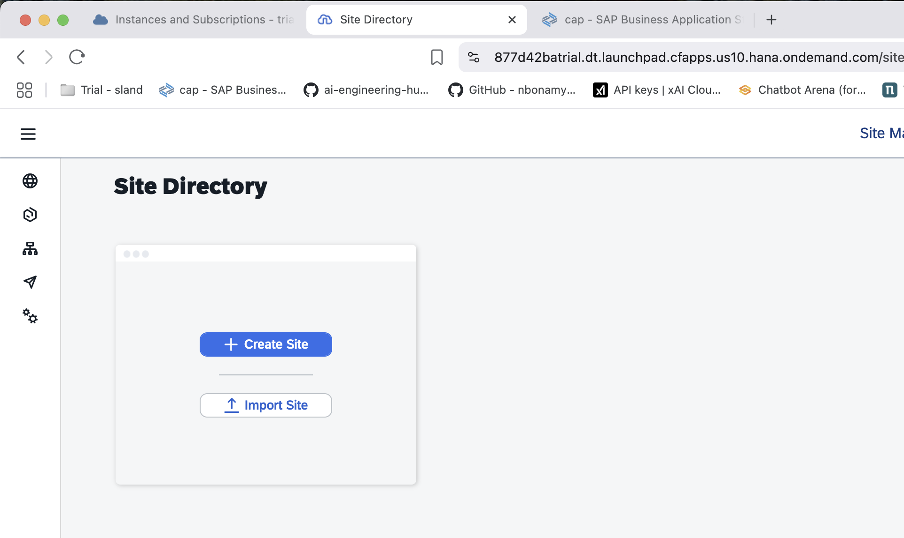

## Clone the application from my repository
1. Open Business Application Studio and click on **Clone Project from Git**

1. Add this repository <https://github.com/simfer/bookmanager.git> and clone it

## Build and deploy the application
1. Open a new Terminal window in the project
1. First run `npm i` to install all the required NodeJS libraries
1. Then run `npm run build` to run the build of the project. This command is equivalent to **mbt build**
1. Login to Cloud Foundry Organization and Space using the command `cf login --sso`
1. Run the command `npm run deploy` to execute the deployment of the application
1. Once the deployment is finished you should see a new application under the **HTML5 Applications** branch in the BTP cockpit
    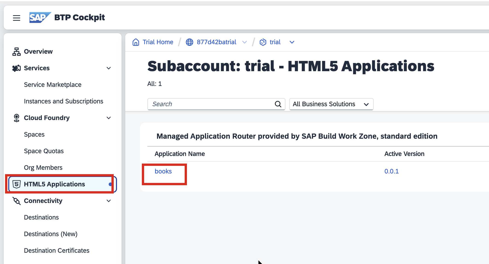
1. Click on the application **books** and the application will start
    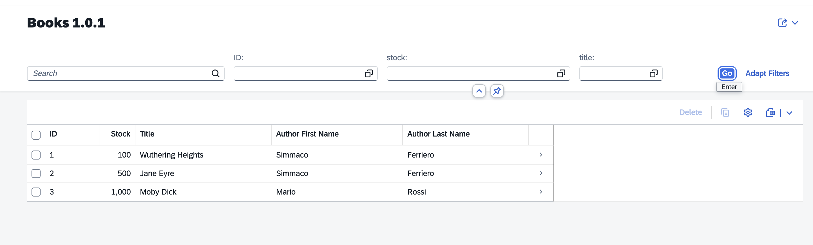
